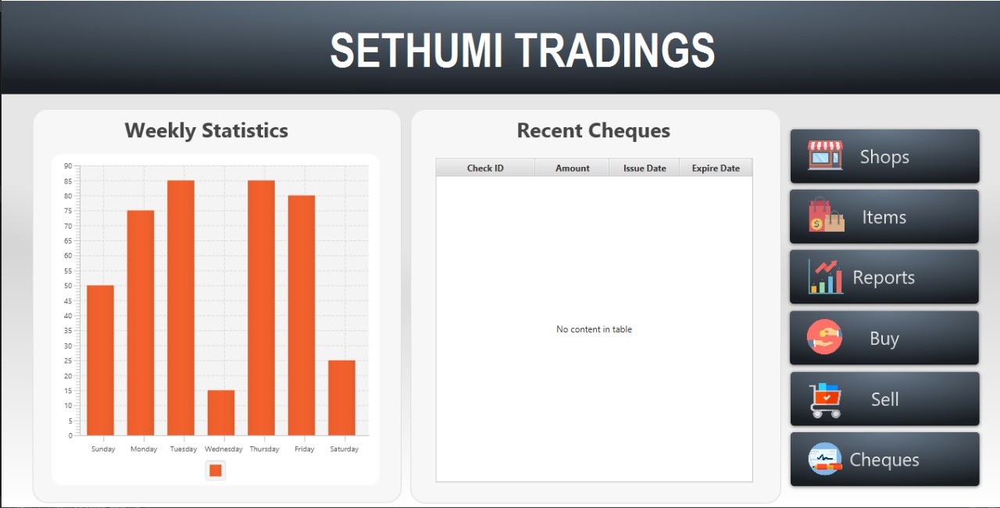
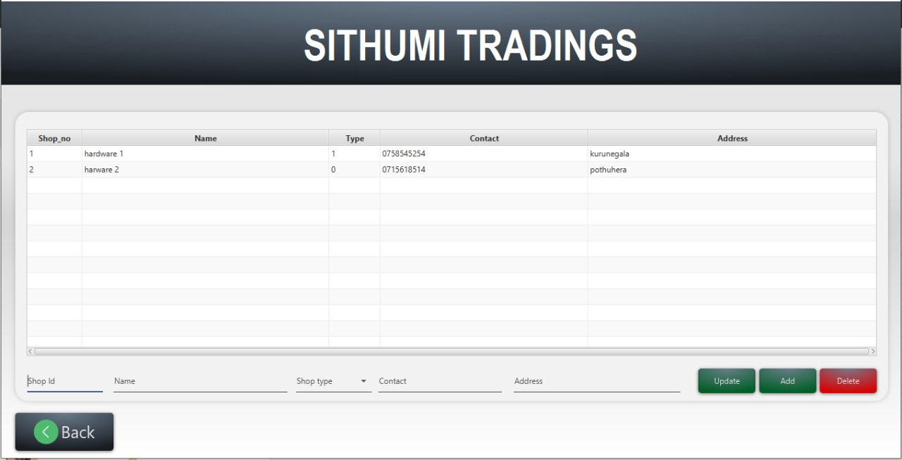
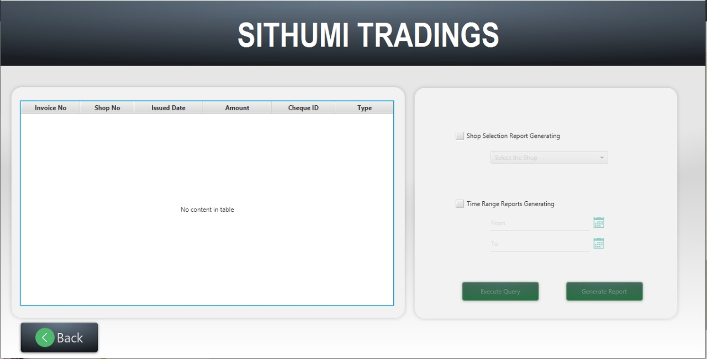
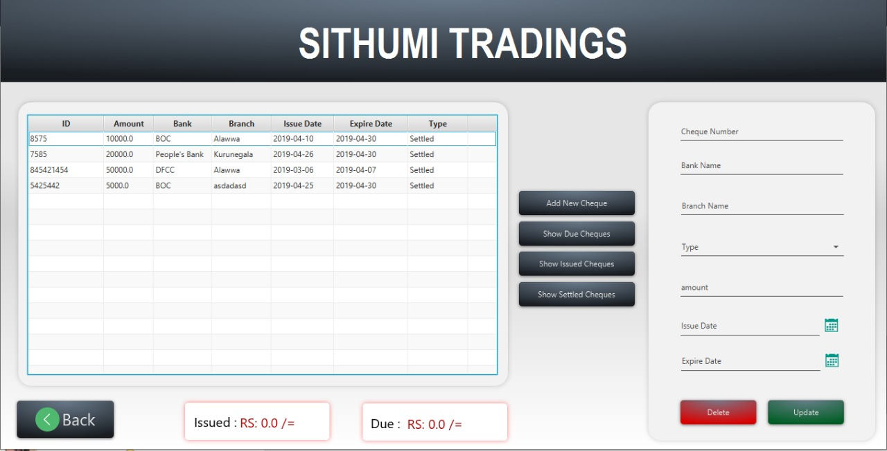

<div>

</div>

# SITHUMI TRADINGS
## An Inventory Management System

### Introduction
In this project, we built up an inventory management system for a client in *Alawwa city, Kurunegala, Sri Lanka*. The system is capable to handle all the funtionalities which are client expected, such as handling information of shops and items, manage cheques related information, report generating, etc.

### Screenshots


<br>



<br>



<br>



<br>

### Project Scope

**IN SCOPE**
- Full featured stand alone PC application for handling inventory information.
  - handling buyers and sellers shop information
  - handling items information related to the shops
  - managing cheques information
  - managing invoices information
- Report generating in PDF format
  - In time and shop based report generating

**OUT SCOPE**
- The system does not concern about the size of the memory storage devices.

<br>

### Used Technologies

- [Java Language](https://www.java.com/en/)
- [JavaFX platform](https://openjfx.io/)
- [Scene Builder](https://gluonhq.com/products/scene-builder/)
- [SQLite Database Management](https://www.sqlite.org/index.html)
- [PDFbox library](https://pdfbox.apache.org/)
- [Intellij Idea Community Edition](https://www.jetbrains.com/idea/download/#section=linux)

<br>

### Installation Guidance for developers

**PREREQUISITES**

- Java Development Kit 8
- JavaFX version 8
- Intellij Idea Community Edition ( You can choose any development environment as your expectations)

**HOW TO INSTALL**

- Fork and clone the github repository of the project.
- Use **Open from existing code** method in IDEA to open the project.
- Import all the relevant libraries and modules.
- Create a folder named "db" at the C drive partition in windows. If you are using different kind of operating system you have to change the location of the database in the [connection.java](https://github.com/SKYSYSLK/sithumiTradings/blob/master/src/models/connection.java) file.

```
............
............
connection = DriverManager.getConnection("jdbc:sqlite:<db_file_location>");
............
```
- After importing all the relevant libraries and modules run the [migrate.java](https://github.com/SKYSYSLK/sithumiTradings/blob/master/src/resources/db/migrate.java) file to execute the fundamental database migrations.
- Finally run the [run.java](https://github.com/SKYSYSLK/sithumiTradings/blob/master/src/run.java) file to build and run the application in your operating system.

<br>

### Developers
<table>
<tr>
<td align="center"></td>
<td align="center"></td>
<td align="center"></td>
<td align="center"></td>
<td align="center"></td>
</tr>
<tr>
<td align="center"><a href="https://github.com/RavinduSachintha">Ravindu Sachintha</a></td>
<td align="center"><a href="https://github.com/Danushka96">Danushka Herath</a></td>
<td align="center"><a href="https://github.com/Sacheerc/">Sachintha Rathnayake</a></td>
<td align="center"><a href="https://github.com/AsithaIndrajith">Asitha Indrajith</a></td>
<td align="center"><a href="https://github.com/ShehanKule">Shehan Kulathilake</a></td>
</tr>
</table>

<br>

### Contributing
Warmly welcome to developers for contributing **Sithumi Tradings** Project. Make sure to open an issue and communicate with us before creating a Pull Request.

<br>

### License

The Sithumi Tradings System is open-sourced software solution licensed under the [GNU General Public License v3.0](./LICENSE).

